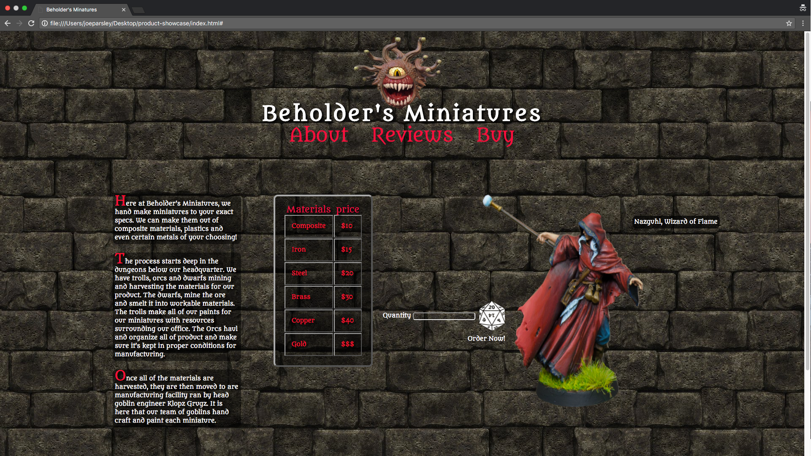

# CSS week #1 Independent Project

## Created by Joe Parsley

## User Story

* I'd like this webpage to demonstrate my understanding of absolute and relative positioning, pseudo classes, pseudo elements, and other CSS basics.

  

## Setup/Installation Requirements

  * Go to this <a href="https://github.com/joeparsley/Product-Showcase">GitHub<a> Repo
  * Clone the rep to your Local machine
  * Open index.html

## Bugs
There are no known bugs at this time, but please contact the creator with questions or concerns regarding this application.

## Technologies Used

  * HTML
  * Hover.CSS
  * CSS
  *
  *

## Licensing
This application features MIT licensing.

Copyright &copy; 2017 **Joe Parsley** All Rights Reserved.
